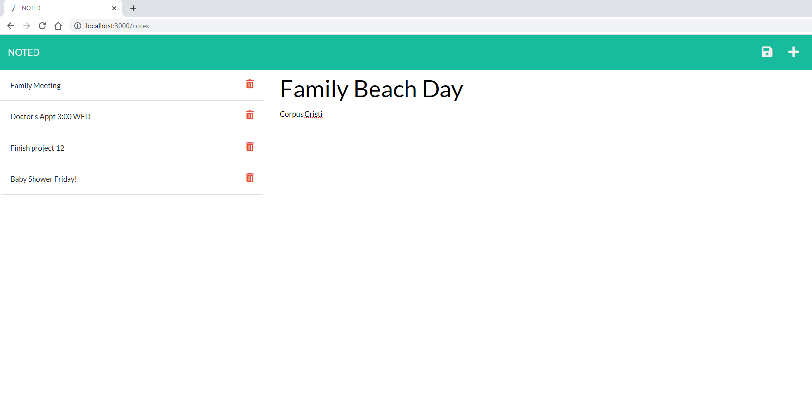
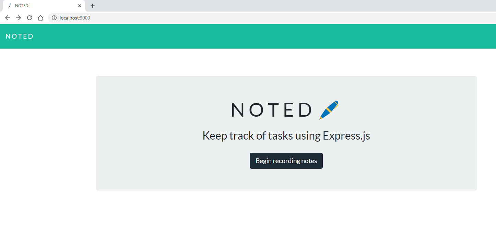
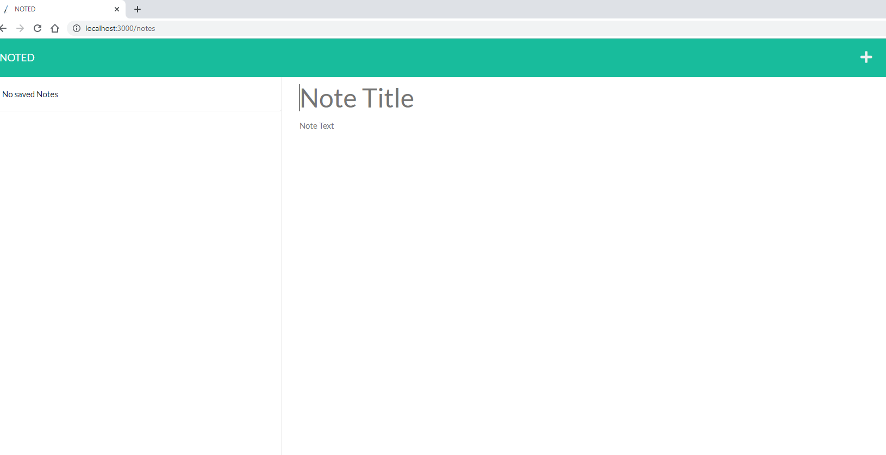
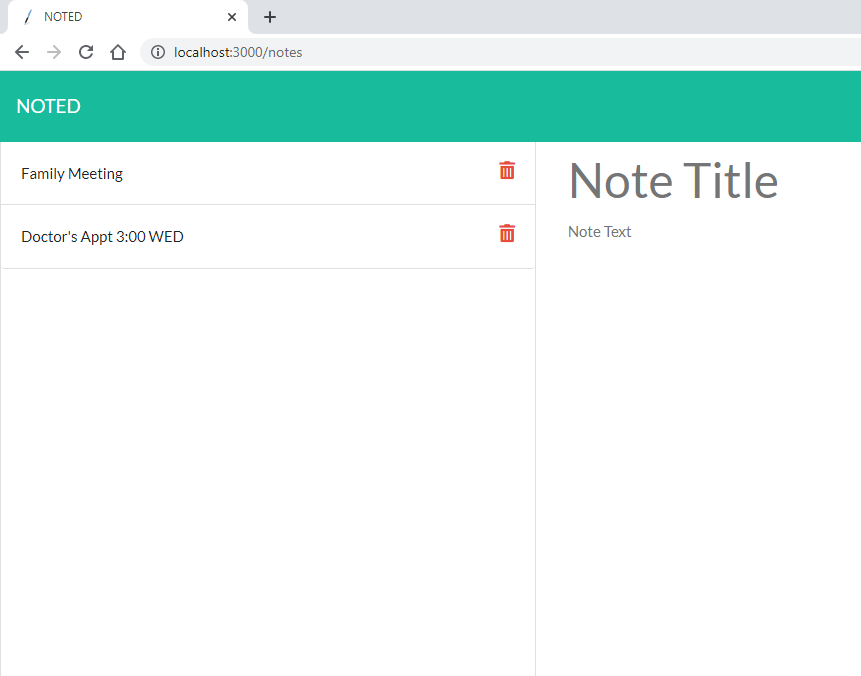

# NOTED:pen: 

  [](https://opensource.org/licenses/Apache-2.0)
## Purpose
To create an app accessable to anyone who wants to
keep track of tasks by adding, saving, and tracking tasks.


"AS A small business owner 
I WANT to be able to write and save notes <br>
SO THAT I can organize my thoughts 
and keep track of tasks I need to complete"





   ## Table of Contents::mag:
   1. [ Installation ](#installation)
   2. [ Usage ](#usage)
   3. [ License ](#license)
   4. [ Contributing ](#contributing)
   5. [ Heroku ](#heroku)

   ## Installation:

   To install dependancies, run the following commands:

     ```
     npm install
     ```
     ```
     npm i express
     ```
     ```
     npm i heroku, (as well as) $heroku update 
     ```
     
     In addition to running installation, the server.js was run with 'node server' to GET, POST and delete API calls. These routes called for the data and returned  json to the body and wrote into the database.
     At first the file paths were off, like an extra 's' in style.css so it wouldn't import the styles.
     The routes JS file called for id so I had to add 'id' to the db.json file to call 1, 2, 3, so on. Then the notes started to show under the saved column. Windows wouldn't get the path for the database file db.json so the code for Windows only worked with 
     (path.join(__dirname, "..", "db/db.json")).
    
    The HTML routes called for the GET requests to index.html and notes.html. Index.js created all the functions, query selectors and calls for adding, saving, and deleting new notes. It also handles saving and deleting the notes by the buttons and thier corresponding icon in top right of the notes.html page.

   ## Usage:

    For usage, please make sure to add comments and submit merge requests to Github.com.


   ## License: 

     Apache-2.0 

   [Link to Apache-2.0 license](https://opensource.org/licenses/Apache-2.0)


  

   ## Contributing:
   Please be kind and professional when adding to or accessing this repository. Thank you!
  [More on Contribution Guidelines](https://github.com/verokoles/readme-generator/blob/f57cf6a98bf276960885496059df4b039247c985/contributing.md)
  
   ## Heroku:heavy_plus_sign:
   See my repo deployed to [Heroku.com](https://mighty-sea-96505.herokuapp.com/)


