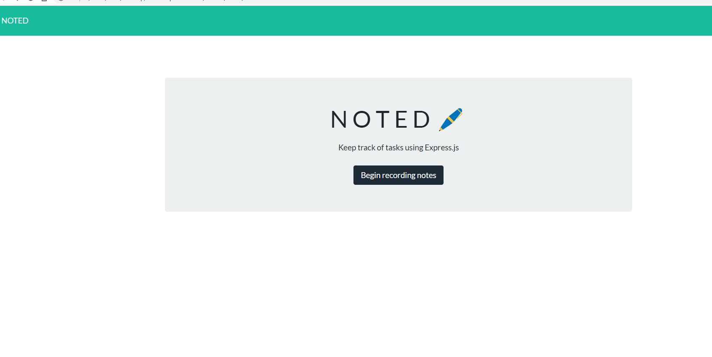

# NOTED:pen: 

  [](https://opensource.org/licenses/Apache-2.0)
## Purpose
To create an app accessable to anyone who wants to
keep track of tasks by adding, saving, and deleting tasks.
<br>
<br>
"AS A small business owner <br>
I WANT to be able to write and save notes <br>
SO THAT I can organize my thoughts 
<br>
and keep track of tasks I need to complete"




   ## Table of Contents::mag:
   1. [ Installation ](#installation)
   2. [ Usage ](#usage)
   3. [ License ](#license)
   4. [ Contributing ](#contributing)
   5. [ Heroku ](#heroku)

   ## Installation:

   To install dependancies, run the following commands:

     ```
     npm install
     ```
     ```
     npm i express
     ```
     ```
     npm i inquirer
     ```

   ## Usage:

    For usage, please make sure to add comments and submit merge requests to Github.com.


   ## License: 

     Apache-2.0 

   [Link to Apache-2.0 license](https://opensource.org/licenses/Apache-2.0)


  

   ## Contributing:
   Please be kind and professional when adding to or accessing this repository. Thank you!
  [More on Contribution Guidelines](https://github.com/verokoles/readme-generator/blob/f57cf6a98bf276960885496059df4b039247c985/contributing.md)
  
   ## Heroku:
   See my repo deployed to [Heroku.com]()


